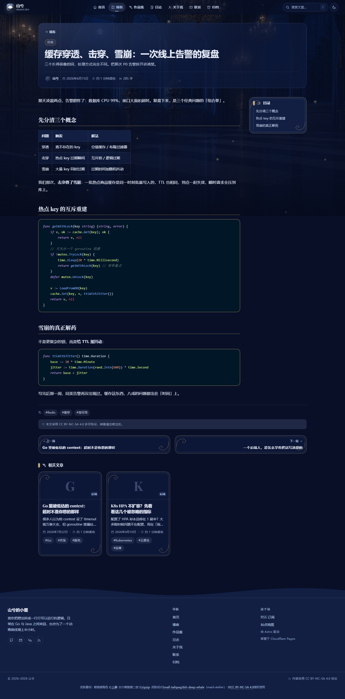

#  shanxi-site

> 一个个人作品集网站，支持移动端和pc端

纯静态个人站点，基于Astro框架从零搭建，零后端、零动画库。

---

## 技术栈

| 层级 | 选型 | 说明 |
|------|------|------|
| 框架 | [Astro 7](https://astro.build) | 内容驱动型静态站点框架，Islands 架构 |
| 样式 | [Tailwind CSS v4](https://tailwindcss.com) | 原子化 CSS，Vite 插件模式集成 |
| 语言 | TypeScript 5.7+ | strict 模式全量启用 |
| 内容 | Astro Content Collections + MDX | Zod schema 构建期校验 |
| 搜索 | [Pagefind](https://pagefind.app) | 构建后生成静态索引，零运行时成本 |
| 字体 | Quicksand + Playfair Display + Noto Serif SC | Google Fonts CDN，display=swap |
| 代码高亮 | Shiki | github-light / night-owl 双主题 |
| SEO | @astrojs/sitemap + @astrojs/rss + OpenGraph | 全套元信息 |

---

## 功能特性

### 核心架构

- **纯静态零后端**：构建产物为纯 HTML/CSS/JS，可部署到任意静态托管
- **单一配置源**：站点身份、导航、社交链接、功能开关集中在 `src/config.ts`，改一个文件即改全站
- **内容集合建模**：Blog / Projects / Notes 三类内容各自独立 schema，Zod 构建期校验，字段写错直接构建失败
- **内容查询层**：`src/lib/content.ts` 统一封装草稿过滤、排序规则、派生字段，页面组件不直接调用 `getCollection`
- **i18n 预留架构**：目前所有页面文案走 `src/i18n/` 字典，当前只注册了中文，想扩展其他语言只需要新建字典文件


### 布局

- **双侧边栏**：桌面端三栏布局
  - 左栏：站长名片 / 公告 / 分类 / 标签
  - 右栏：运行状态 / 站点信息 / 交互月历 / 日志
    


### 内容展示

- **博客**：长文，支持分类、标签、置顶、草稿、封面图、阅读时长估算、相关文章推荐（标签交集打分）

<p align="center">
  
  <br />
  <em>博客文章详情页：顶部元信息、右侧目录高亮、底部上一篇 / 下一篇与相关文章推荐。</em>
</p>


- **归档**：按时间线回溯全部文章，支持日期筛选
- **站内搜索**：Pagefind 构建期索引，`/search` 对话框

<p align="center">
  
  <br />
</p>

---

## 项目结构

```
shanxi-site/
├── astro.config.mjs          # Astro 配置（站点 URL、集成、Shiki、预取）
├── package.json
├── tsconfig.json             # strict 模式 + 路径别名
├── scripts/
│   ├── build.mjs             # 程序化构建入口（绕过沙箱 safe-delete 拦截）
│   ├── serve.mjs             # 本地预览服务器
│   ├── screenshot*.mjs        # 截图验证脚本
│   └── verify-*.mjs          # 视觉回归验证
├── public/                   # 静态资源（favicon、OG 图、吉祥物）
└── src/
    ├── config.ts             # 站点全局配置 —— 单一真源
    ├── content.config.ts     # 内容集合 schema 定义
    ├── layouts/
    │   ├── BaseLayout.astro  # HTML 骨架 + SEO 元信息 + 主题预置
    │   └── PageLayout.astro  # 双侧边栏框架
    ├── components/
    │   ├── home/             # 首页 Hero
    │   ├── layout/           # Header / Footer / Drawer / MobileTabBar / SearchDialog
    │   ├── sidebar/          # 侧边栏卡片组件群
    │   └── ui/               # 通用 UI 组件（Icon / Card / TOC / BackToTop 等）
    ├── content/
    │   ├── blog/             # 博客文章（Markdown）
    │   ├── projects/         # 项目卡片（Markdown）
    │   └── notes/            # 碎碎念便签（Markdown）
    ├── lib/
    │   ├── content.ts        # 内容查询层
    │   └── utils.ts          # 工具函数（日期格式化 / 阅读时长 / 哈希等）
    ├── i18n/
    ├── scripts/
    │   ├── enhance.ts        # 渐进增强 —— 全站唯一客户端逻辑入口
    │   └── theme.ts         # 主题切换逻辑
    ├── styles/
    │   └── global.css        # 设计令牌 + 全局样式
    └── pages/
        ├── index.astro       # 首页
        ├── blog/             # 博客列表 + 文章详情
        ├── projects/         # 作品集列表 + 项目详情
        ├── notes/            # 碎碎念便签墙
        ├── about.astro       # 关于我
        ├── contact.astro     # 联系方式
        ├── archive.astro     # 归档
        ├── 404.astro
        └── rss.xml.ts        # RSS 生成
```

---


### 环境要求

- Node.js 18+ （推荐 22+）
- npm

### 安装与运行

```bash
# 安装依赖
npm install

# 启动开发服务器
npm run dev

# 构建生产版本
npm run build

# 本地预览构建产物
npm run preview

# 类型检查
npm run check
```

构建产物输出到 `dist/`，构建后自动运行 Pagefind 生成搜索索引。

### 自定义配置

修改 `src/config.ts` 一个文件即可完成全站定制：

- `SITE`：站点标题、描述、URL、主题色、语言
- `AUTHOR`：站长信息、标语、简介
- `SOCIALS`：社交链接
- `NAV`：导航菜单
- `FEATURES`：功能开关（气泡粒子 / 阅读进度 / 搜索 / 评论 / View Transitions）
- `PAGE_SIZE`：列表分页大小

### 添加内容

```bash
# 新建博客文章
# 在 src/content/blog/ 下创建 YYYY-title.md
# frontmatter 需包含 title / description / published / category / tags

# 新建项目卡片
# 在 src/content/projects/ 下创建 name.md

# 新建日志
# 在 src/content/notes/ 下创建 YYYY-MM-DD-title.md
```

---

## 许可协议

- 代码部分：MIT License
- 文章内容：[CC BY-NC-SA 4.0](https://creativecommons.org/licenses/by-nc-sa/4.0/)

---
